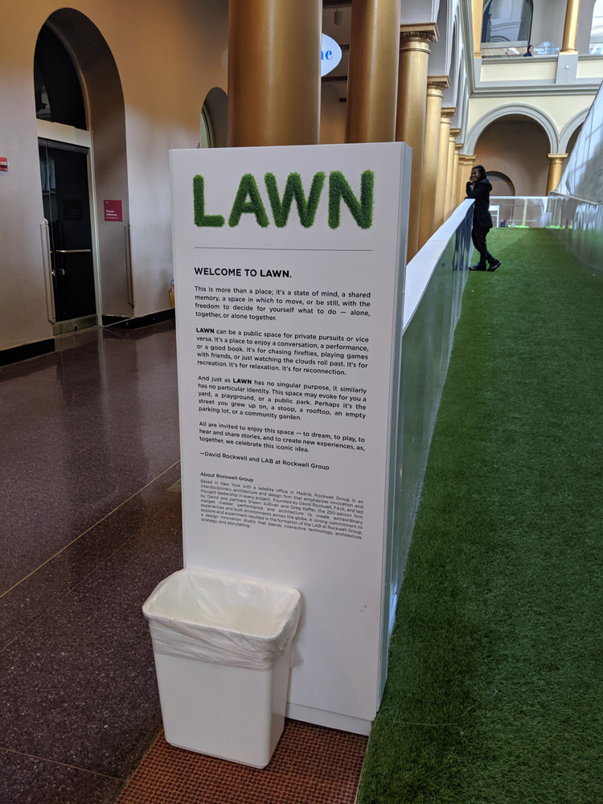
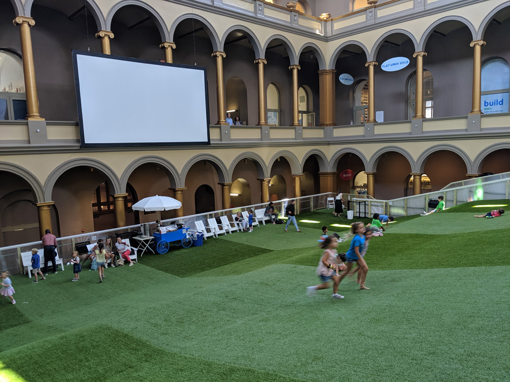
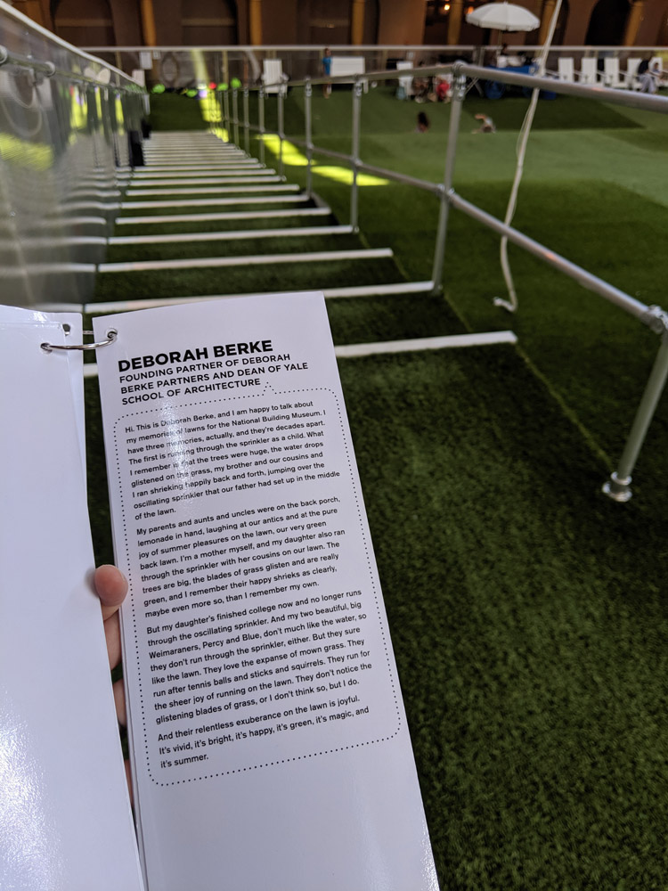
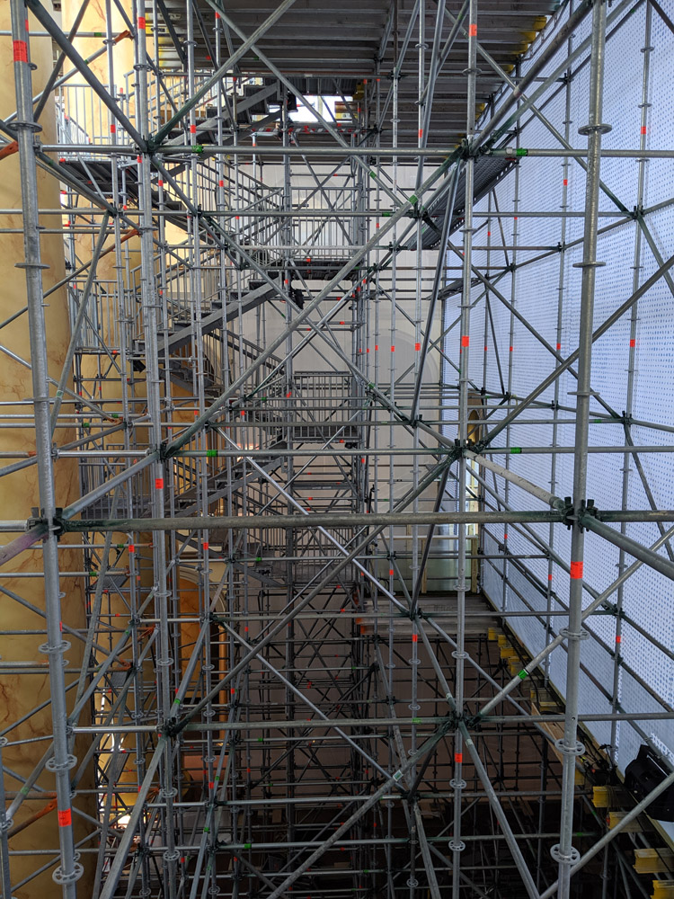
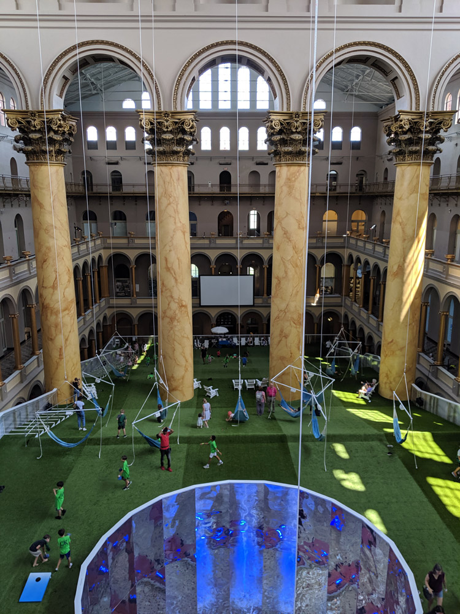
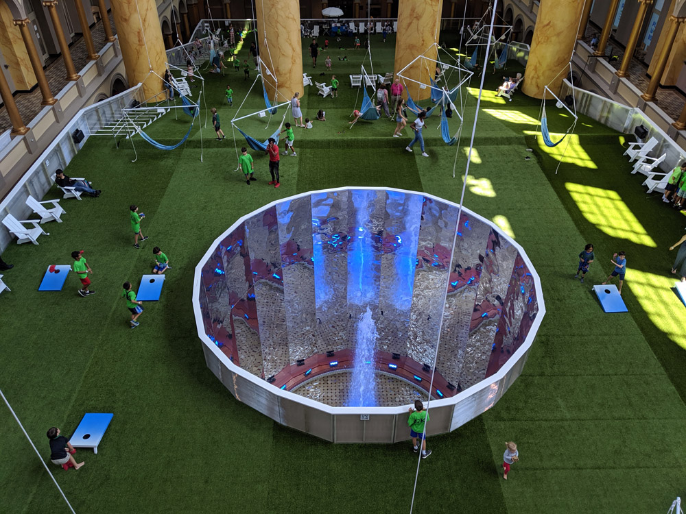
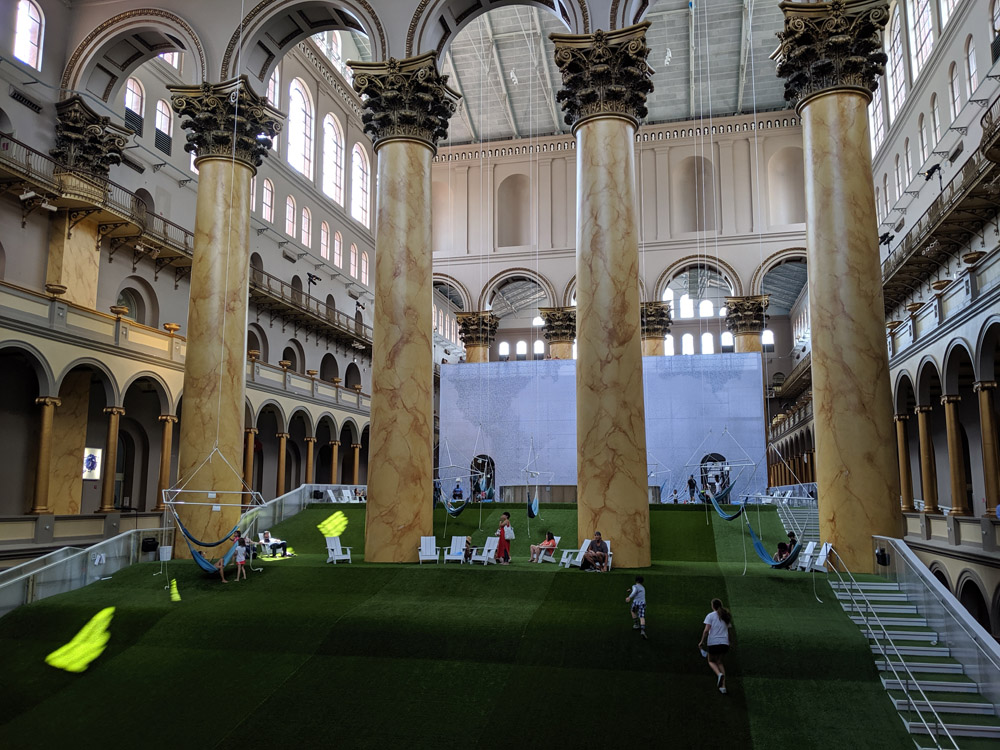

+++
date = "2019-09-23T07:43:00.000-07:00"
title = "Exhibition Review: \"LAWN\""
tags = ['exhibition review', 'suburbia', 'museum']
draft = false
+++
Two years ago, I visited the National Building Museum over the summer and experienced their annual summer installation, which at the time was a pink-and-silver mountain of cardboard tubes installed by Studio Gang [(see previous post)]().  This summer, since I had the opportunity to visit DC again, I was looking forward to what the museum would have installed.  I have to admit that when I saw the installation was called "LAWN," and was advertised as, well, a big lawn, I was disappointed.  I imagined a roll of astroturf unfurled across the enormous great hall and nothing more.  Fortunately, [LAB at Rockwell Group](https://www.rockwellgroup.com/), well-known for their exhibition design, is more creative when it comes to lawns than I am.

  

Part of my mistrust stemmed from the fact that as an adult, I have strong, negative, feelings about lawns.  The way I see it, lawns are an invasive species in most of the country, requiring tedious upkeep and copious water, which would be better spent cultivating a more useful plant.  In California where I live, every time I see a lawn, I wince, and think of the terrible droughts we face on a regular basis.  [Xeriscaping](https://en.wikipedia.org/wiki/Xeriscaping) is the way to go in our dry climate -- not lawns.  If you're curious about the history of the lawn, and how it became a ubiquitous part of American (suburban) culture, check out this [NYTimes video](https://www.nytimes.com/video/us/100000006542254/climate-change-lawns.html).

What LAB at Rockwell Group did was create an indoor, artificial slope, high above the ground level of the museum, that not only evokes traditional American landscapes, but also allows the museum visitors to get a better look at the building inside which they have built their elaborate topography.  Clad in astroturf, the slope provides opportunities for children to run, roll, and play; for adults to lounge; and for visitors to get up close and personal with some of the building's impressive ornamentation.

An upper deck provides views over the entire space.  An opening in the floor of the mid-level landing reveals the ground-level fountain, surrounded in mirror panels, that reflect the sound and lighting of the fountain up to the lawn.  Lounge chairs and hammocks are positioned throughout the space; each hammock has an attached speaker that plays interviews with designers, celebrities, and others about their experiences with lawns.  Speakers positioned on the perimeter of the installation play an immersive soundtrack of "lawn sounds": cicadas, lawnmowers, bees / buzzing, thunderstorms, an ice cream truck, birds, owls, sprinklers, dogs barking, etc.

The programming for the lawn seemed fairly open-ended, but included some standard park activities: movie nights, with a large screen at one end; teen parties; yoga; concerts; and a snack stand.

Overall, I appreciated the exhibition for its diversity of uses, the way it incorporated topography and changes of levels (not just a flat lawn), and the surround-sound ambience.  I spent some time just sitting, watching, and listening, and when a real thunderstorm went by outside, I had a hard time telling it apart from the soundtrack.  And, clearly, the parents of all the small children running around appreciated the indoor, air-conditioned, and dry venue to take their kids in the heat of summer.  I do wish there had been some additional information or education area that could have described the history of lawns, their environmental impact, and alternatives.  No one seemed to be listening to the stories that issued from the hammock speakers; maybe those points made somewhere in the stories.  The space was so large and un-programmed that it did feel nearly like visiting a park, except indoors.

I was pleased that I made it over to the installation during my time in the city, and while it didn't meet all my hopes and expectations for what an exhibit about lawns could be, it will still impressive.  Just the scaffolding alone was an engineering feat, and the thought that went into the sound design, "landscaping", and furniture was clearly substantial. Creating a design that makes good use of the vast space of the Building Museum is no easy task, but LAB at Rockwell Group made it work, and made it work three-dimensionally.  I enjoyed my visit and it seemed like all the families there did too!

