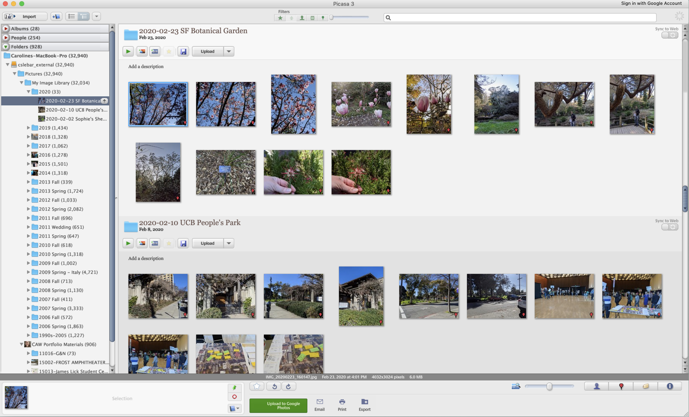
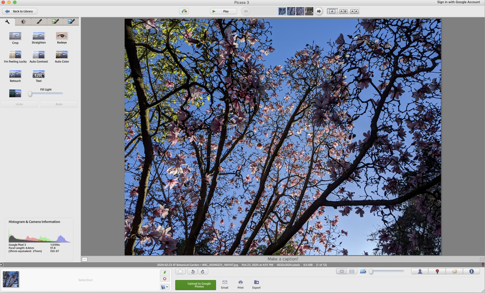

+++
date = "2021-01-03"
title = "Farewell, Picasa"
tags = ['writing']
draft = true
+++

After nearly fifteen years of using [Picasa] (https://en.wikipedia.org/wiki/Picasa) as my primary photo software, I've finally admitted that it's gone, and that I have to say goodbye.  Google stopped supporting Picasa in 2016, and this year, the Mac OS update has killed it and it will no longer work at all.  Google acquired and started distributing Picasa in 2004, and I think I've been using it since 2006, so it had a solid run.  Why am I mourning the loss of this program?  It was fast, intuitive, and integrated well with my blogging and photo-sharing workflows; now I have nothing like that.  I could save my photos to my hard drive or external drive, where they would be automatically imported; I could edit, and Picasa would automatically save back-up copies of the original images; and I could export directly from Picasa to Google Web Albums or Blogger or even Snapfish, where my images were then available for easy use.  Of course, this workflow assumed, in some sense, that my photos did not originate on the web to begin with, which was no longer true once I started using a Pixel phone.  But I have never enjoyed editing photos on the web, I prefer to download them to my hard drive for backup purposes anyway, so the workflow still worked well for me.  Besides, Google Photos on the web does not integrate with my massive photo collection on my hard drive, so it's useless as a photo organization software.

I'm going to try using Adobe Bridge as my new photo organization software - we'll see how that goes!  It lacks the approachable and user-friendly interface of Picasa; it lacks the ability to export directly to the web and integrate with online services; but it does have direct integration with Photoshop and Camera Raw, which provide vastly superior editing capabilities compared to Picasa.  Editing has never been my strong suit -- I often use photos unedited -- so this isn't a big improvement for me, but at least it feels like less of a downgrade.  Also, the "collections" feature seems much less intuitive than the albums feature in Picasa, so we'll see if that works well.

There are other photo organization programs out there, like digikam, and I might give them a try.  But I will always appreciate the many years of photo organization that I enjoyed with Picasa.

