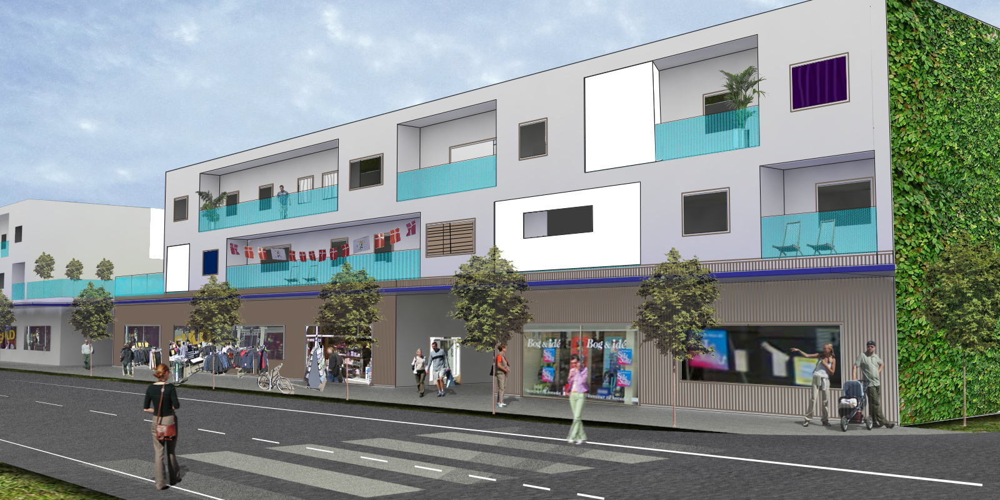
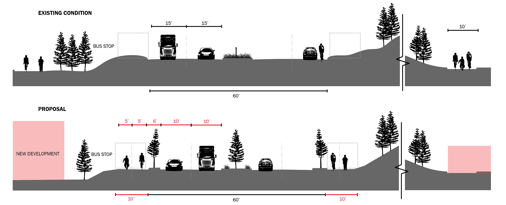
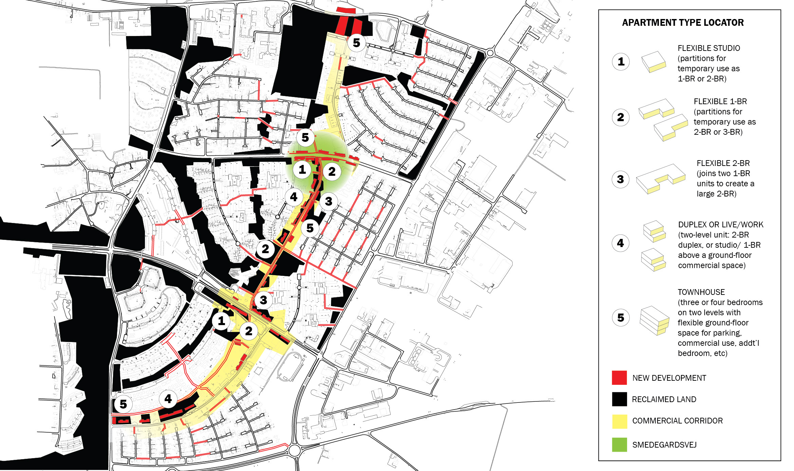
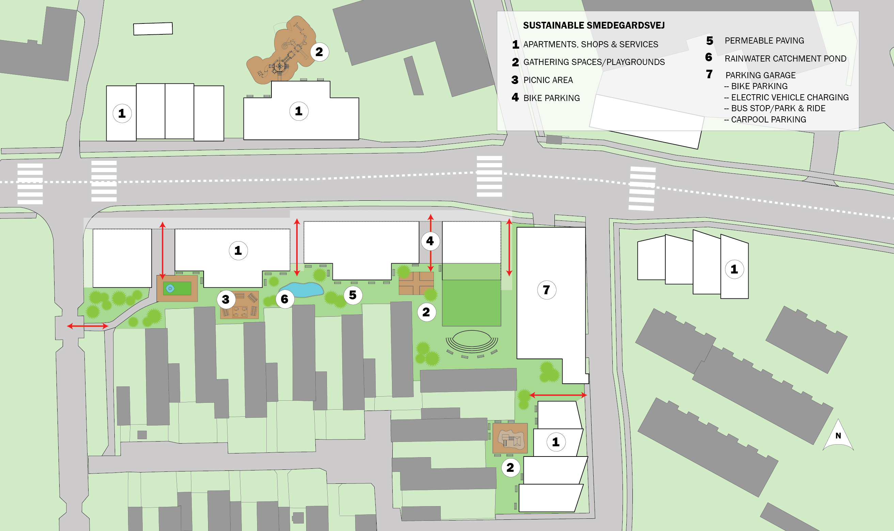
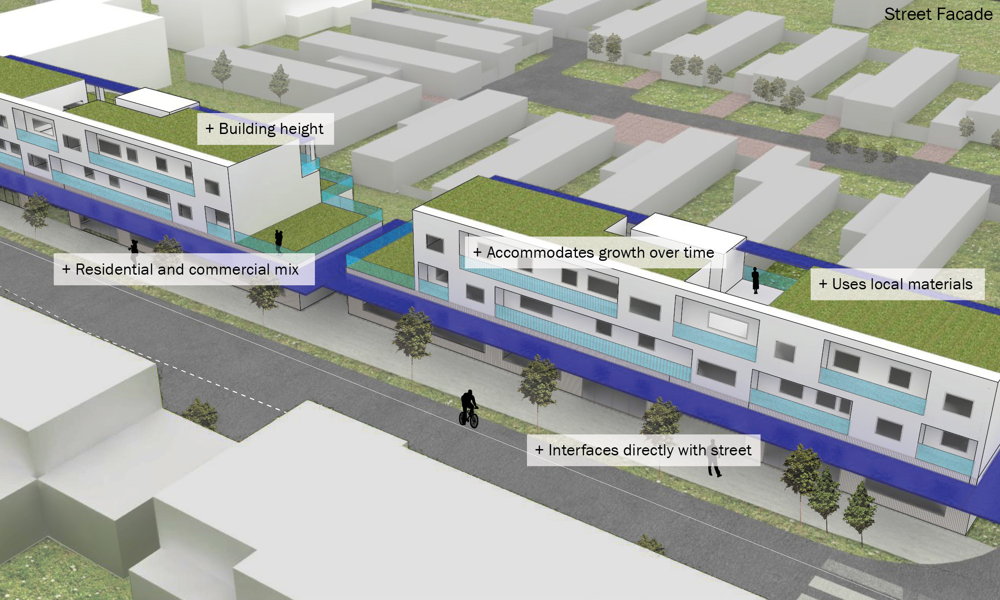
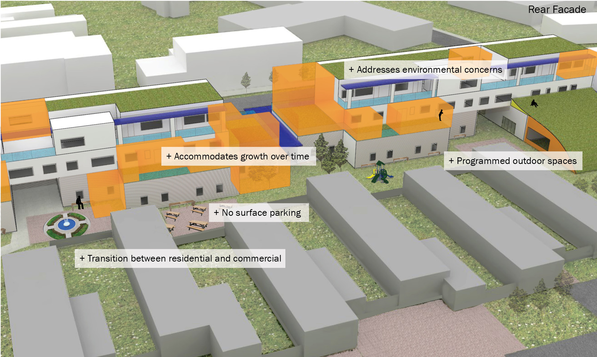

+++
draft = false
image = "img/portfolio/aalborg-cover.jpg"
showonlyimage = true
date = "2019-10-20"
title = "Aalborg Neighborhood Redevelopment"
weight = 1
+++

{}
Streetwise Suburbs: Neighborhood Redevelopment for Mixed-Use, Mixed-Income Communities

Studio: Urban Ecology Studio, Fall 2012, with Richard Plunz and Patricia Culligan  
Team: Caroline Lebar, M. Arch; Amanda Bradshaw, PhD Urban Planning  
Site: Aalborg, Denmark  

How can we bring an intensity of uses and community - the feeling of urban life - to a suburban area, without destroying the quality of life valued by residents?   The studio tested alternatives to redevelopment in a suburb outside of Aalborg, Denmark.
{}

We proposed increased density and sensitive infill projects to encourage community and street life along selected corridors in the neighborhood, and a reworking of the street network to improve connectivity and access across the area.  The current street configuration duplicates the amount of paved paths that are needed without providing either safe paths or lively streets.  By putting streets and sidewalks back together, we expect to ameliorate both problems.  Our street proposal focused on linking dead-end streets and relocating sidewalks, as well as “road diets” (street narrowing) that would provide space for bicycle paths.  Eliminating the excess paths provides area for new infill development without taking away green space or intensifying development in existing neighborhoods.

  

  
  

Our infill housing proposal is influenced by the typology of housing in the city of Aalborg itself rather than by the single-family home typical of the Danish suburbs.  Flexible units allow families to customize their homes and make changes and improvements over time.  The buildings are expected to change and become more built-out as families grow.  Consolidating streets and paths provided us with the land needed for these infill projects, which take on a long and narrow shape to fit the street-side sites.  The street proposal thus provides space for new development that does not detract from existing neighborhoods.

The relationship with the street and with the space between the new housing and the existing neighborhoods is critical to the proposal, as the infill housing units must interact directly with the street while not overwhelming the housing behind.  Programmed rear courtyards with space for recreation, and a stepped rear facade, create a buffer between existing housing and the street, while large arcades containing entrances to ground-floor amenities draw neighborhood residents through the buildings.  The infill typology is designed to be flexible enough to accommodate a range of long and narrow sites while maintaining its apartment configurations.  Amenities provided for the new units can be shared with the existing neighborhood, and the ground-floor retail and services will help contribute toward a more lively street life.

