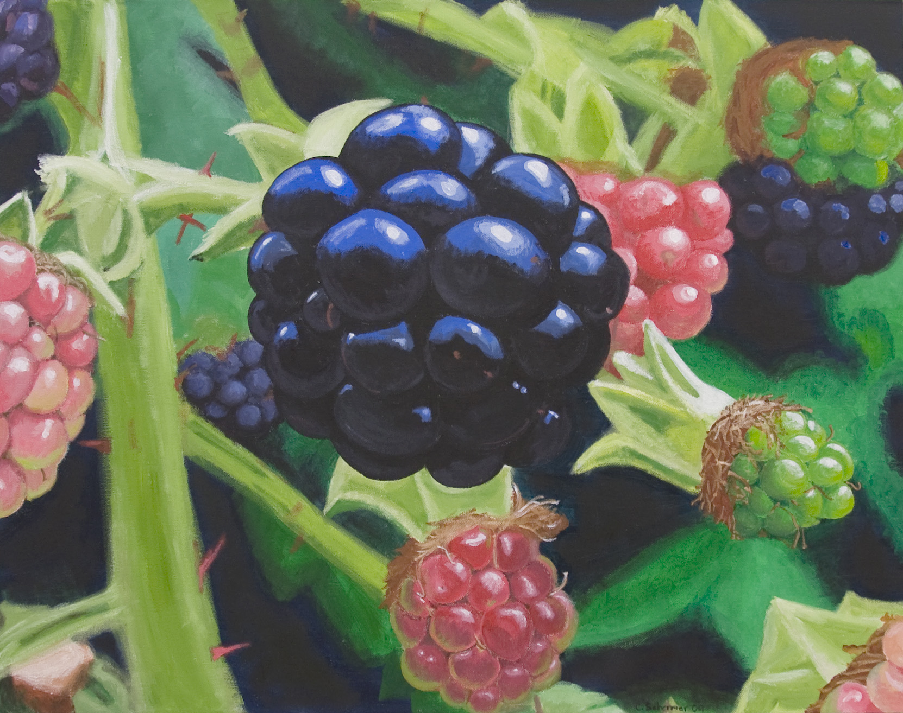
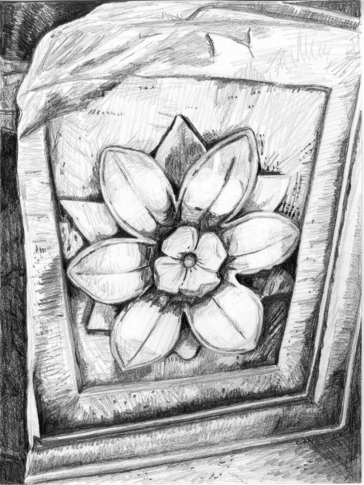
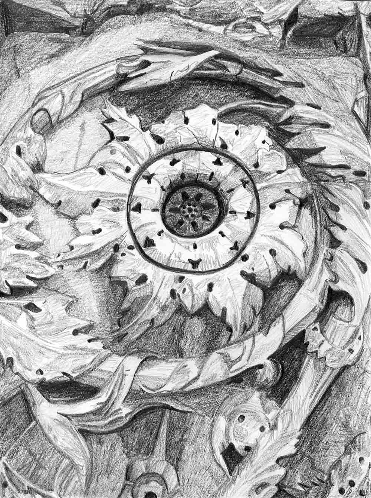
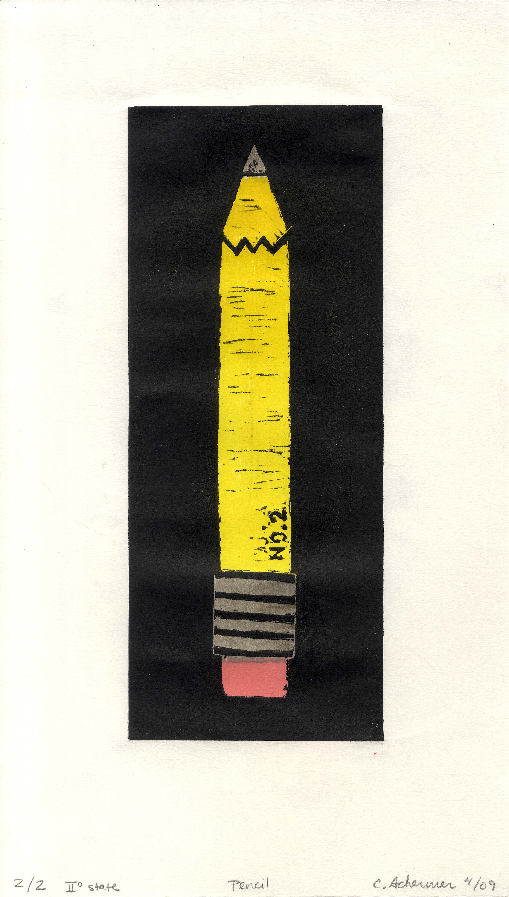
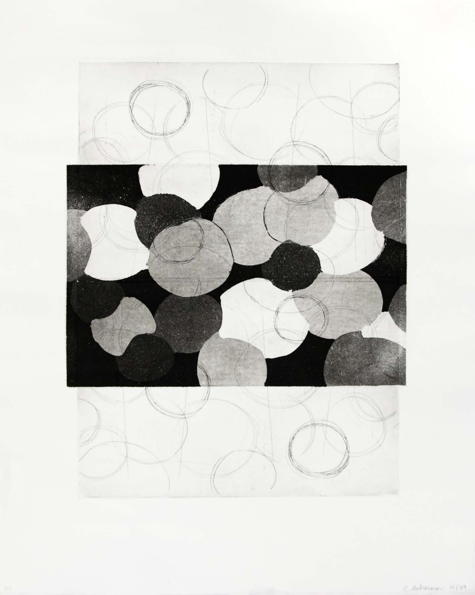
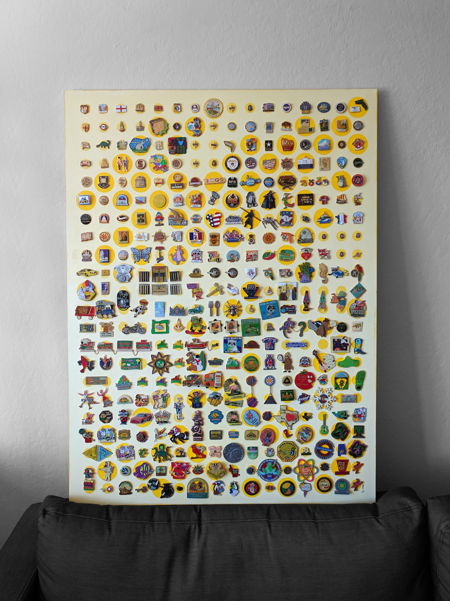
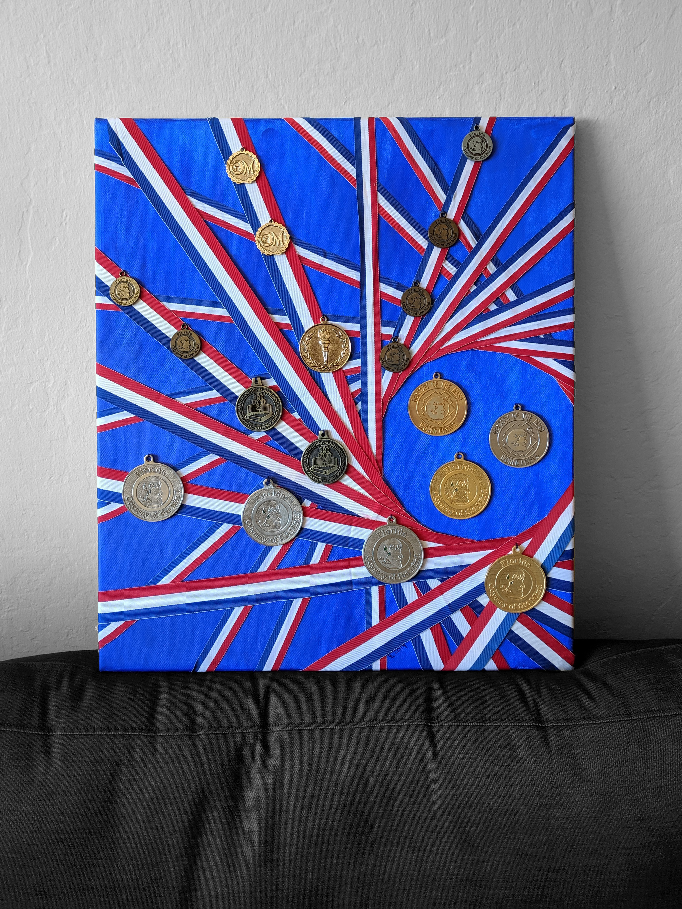
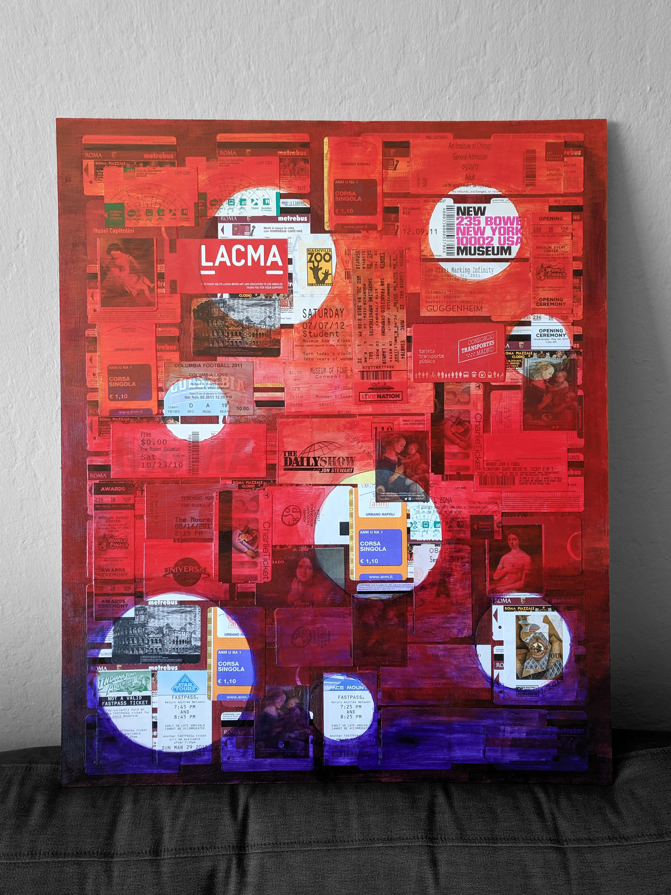

+++
draft = false
image = "img/portfolio/art-cover.jpg"
showonlyimage = true
date = "2019-10-05"
title = "2D Design"
weight = 1
+++

{}
Drawing, Painting, Mixed Media, and Graphic Design

My 2D design work allows me to explore methods of representation, form and abstraction, and new technologies and materials (software, mixed media).  Most of my graphic design efforts have been for the benefit of non-profit organizations where I volunteer.  I enjoy getting to try out new techniques and finding new ways to use materials that I have on hand.
{}

