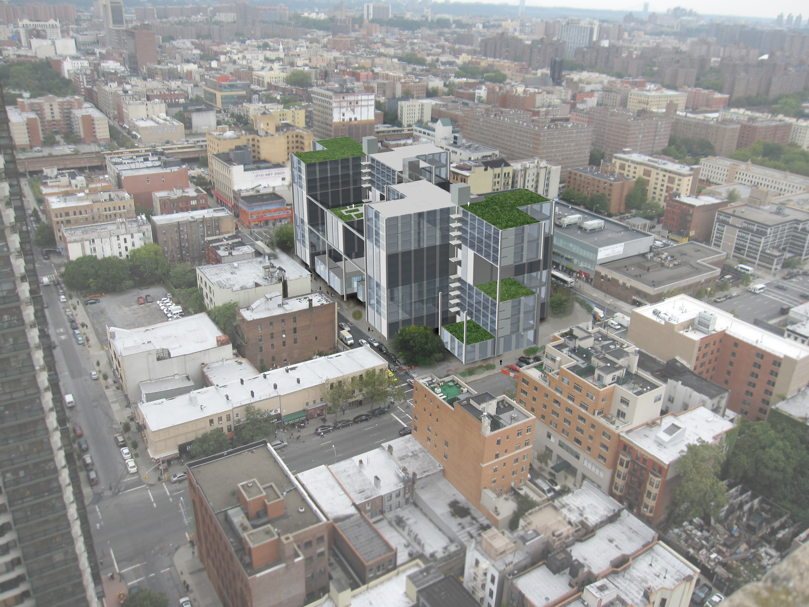
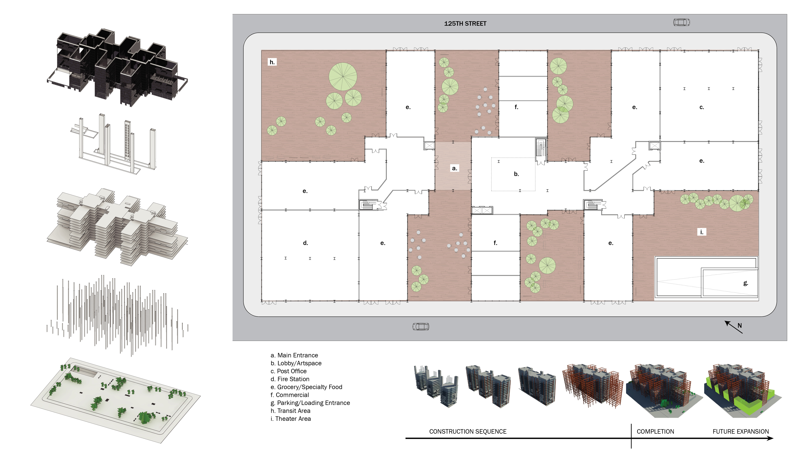
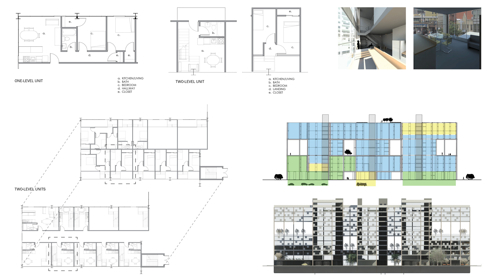
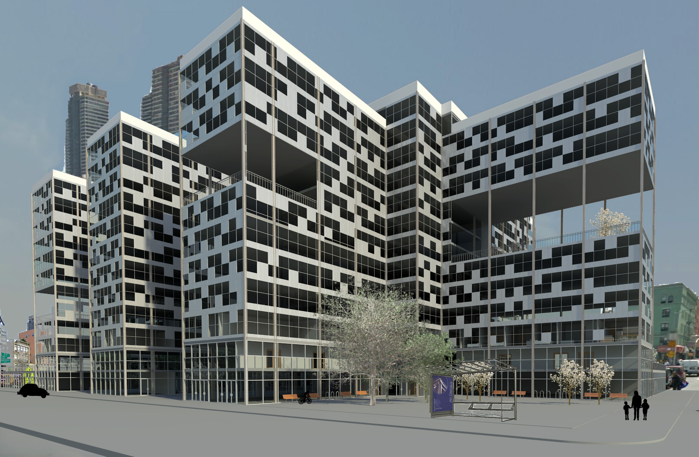
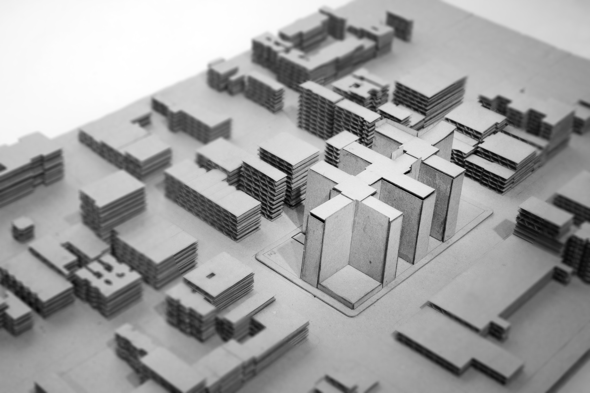

+++
draft = false
image = "img/portfolio/housing-cover.jpg"
showonlyimage = true
date = "2019-10-19"
title = "Flexible Housing for Harlem"
weight = 1
+++

{}
Permanent Flexibility: Future-Oriented Housing

Studio: Housing Studio, Fall 2011, with Frederic Levrat  
Team: Caroline Lebar and John Barnes  
Site: Harlem, New York City, New York  

How do we plan for the changing needs of families and neighborhoods, and for the impact of future technology on our methods of working, recreation, and family interaction?  We looked at Harlem, NYC as a potential site for a housing development that could accommodate future changes.
{}

Our housing complex design incorporates the findings of our urban study, which called for future-oriented designs, or what we have termed “permanent flexibility.”  The apartment floors can easily be converted to offices, and vice versa, since a structural grid was chosen based on the needs of both types of programs.  The apartments are accessed from central cores that contain communal spaces (rec rooms, computer labs, laundry facilities) for the residents, or that can be used as lobbies for commercial floors.  Deep “mega-balconies” on multiple levels provide sheltered outdoor space.

At the street level, the various “wings” of the building provide large areas of retail, food stores, and public services, while offices on the second level are visually accessible from the street.  A much-needed high school is incorporated into the second level.  All building parking is underground.

The individual apartment units are designed to accommodate a range of family sizes, and include both two-level “lofts” and single-level standard units.  The units contain balconies that can be expanded over time, and the entire footprint can also accommodate future infill development around the perimeter.

The unit details - panels and balconies - are also designed with future change and expansion built-in.  The balconies can be “colonized” by adding enclosure, or can be expanded by building outward, extending the grid.  The facade system, which uses  interchangeable modular panels, allows the building residents to adjust the amount of light entering their rooms by re-arranging the panels.  The result on the building scale is a highly flexible and idiosyncratic arrangement of paneling.

