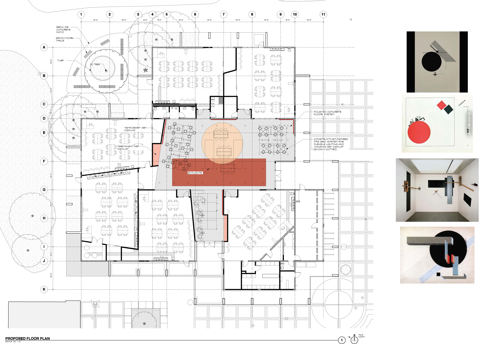

+++
image = "img/portfolio/ihs-b-cover.jpg"
showonlyimage = true
draft = false
date = "2019-11-03"
title = "Independence High School Art Building"
weight = 1
+++

{}
East Side Union High School District

Role: Job Captain and Designer, CAW Architects  
Site: San Jose, CA  
Completed: 2016  
Project Size: 14,000 SF, major renovation  

As part of a campus reorganization, the Art Department at Independence High School planned to move from their quad of four buildings to one large building, which previously served as offices, teacher lounge, and classrooms.  Working within the existing footprint, the project team designed a new central gallery space, surrounded by classrooms, to recreate the collaborative environment of the former arts quad.  
{}

The building (B1) had been damaged in a fire and required extensive renovation.  In addition to mitigation of the damage and structural repairs, the design team provided an entirely new organization of the interior space.  Three of the new classrooms open directly to the central gallery with glass overhead doors, allowing the gallery to be extended for art shows, presentations, or performances.  Within the gallery, a system of pipe grid and flexible lighting provide a canvas for hanging shows, together with custom art display cases and extensive pin-up space.  The interior design was inspired by Russian Constructivist artwork, with an overall grid structure broken up by free-floating geometric shapes and vibrant colors.

The new classroom spaces include a photography studio with dark room, ceramics studio with kiln, and four general purpose art classrooms.  A new outdoor art area was designed with a custom water-jet-cut steel fence, to provide space for outdoor instruction and practice.  New windows were installed to provide natural light in most classrooms (except photography), and skylights installed to bring light to the gallery.

