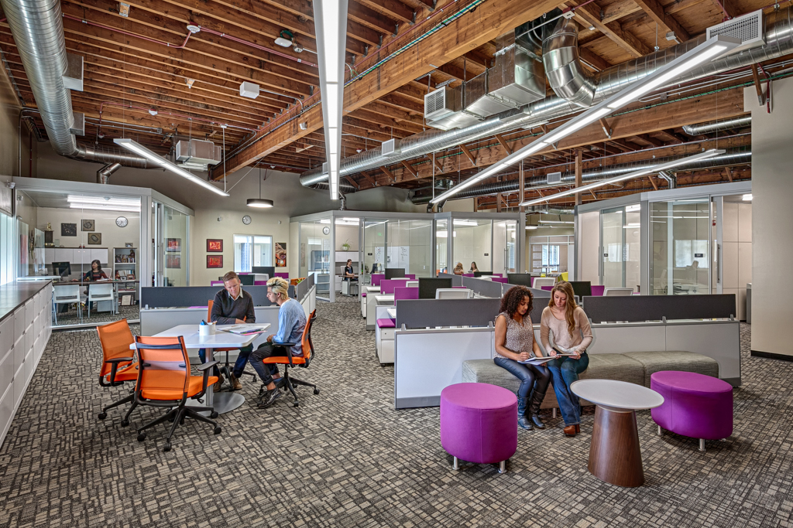

+++
image = "img/portfolio/ihs-n-cover.jpg"
showonlyimage = true
date = "2019-10-31"
title = "Independence High School Administration Buildings"
draft = false
weight = 1
+++

{}
East Side Union High School District

Role: Designer, CAW Architects  
Site: San Jose, CA  
Completed: 2014  
Project Size: 12,000 SF, major renovation  

Due to changing demographics, Independence High School began sharing several buildings on its campus with alternative schools, and relocated its main administration building from the south side of campus to the north, opposite side.  The design team renovated two former classroom and weight room buildings (N1 and N2) into the new administrative hub, designed to house the main administrative office, conference rooms, teacher lounge, a health clinic, a tutoring center, and the counseling office.  
{}

The project included new glazing for improved daylighting, new interior storefront walls to promote visibility and transparency, and updated finishes and furnishings.  A glass overhead door was designed into each building, facing across the courtyard, allowing the courtyard to be used for events between the two buildings.  Student, faculty, and parent events can now be held in the new tutoring space, and students operate a coffee bar in this space before and after school to give their fellow students a safe space for studying, tutoring, and socializing.

